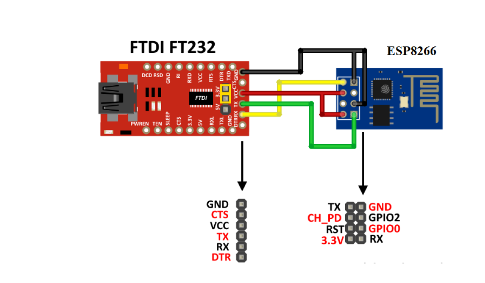
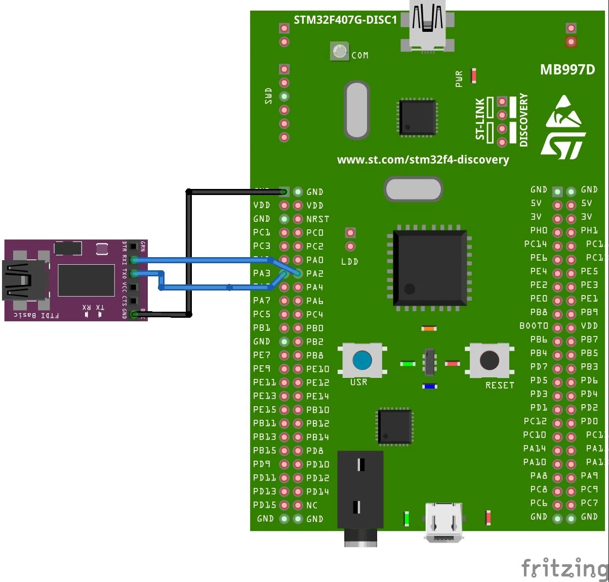
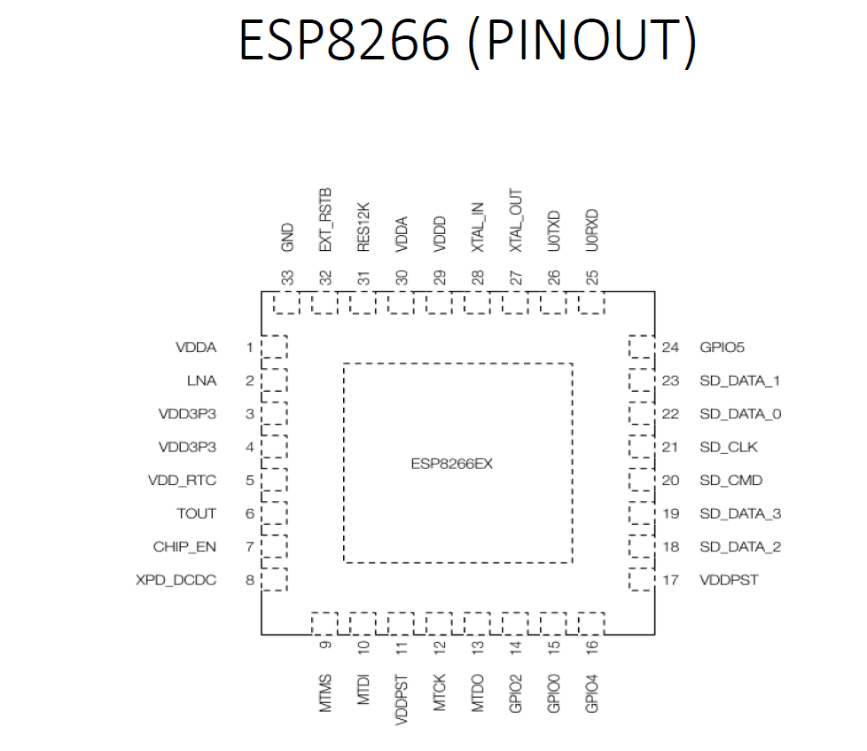

# stm32-esp8266-station-at
STM32F4 + ESP8266 station‑mode via AT commands.

Configuring an ESP8266 in station mode (under an access point),
sending AT commands via USART2,
and displaying the response (character string received by the MCU 
and sent by the ESP8266) through the USART3 interface
## Project Setup
Here is how the esp8266 and FTDI are connected:

connexion between STM32F4 and FTDI :

The pinout of the esp8266:

